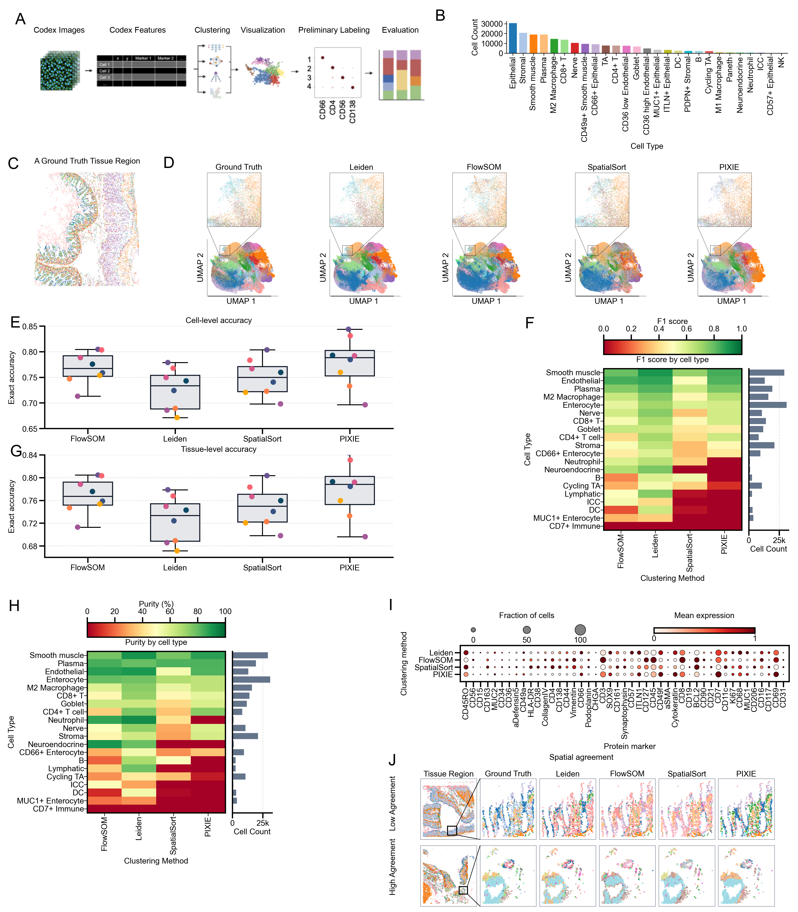

# Evaluation of Clustering Methods and LLMs for CODEX Cell-Type Annotation

Reviewer-facing analysis repository for the manuscript *Evaluation of
Clustering Methods and Large Language Models for Spatial Proteomic Cell Type
Annotation*.

The canonical figure notebooks, visible results, input contracts, and shared
analysis code are kept together here. Raw data and generated run artifacts are
excluded from Git.

## Start here

No setup is needed to inspect the results on GitHub. Open a notebook in the
table below; each one either contains its executed plots or shows a
source-traced publication preview near the top.

| Item | Notebook | Visible result |
| --- | --- | --- |
| Figure 1 | [`figure_01_spillover_compensation.ipynb`](notebooks/final_figures/figure_01_spillover_compensation.ipynb) | Executed plots embedded |
| Figure 2 | [`figure_02_clustering_method_benchmark.ipynb`](notebooks/final_figures/figure_02_clustering_method_benchmark.ipynb) | Publication preview |
| Figure 3 | [`figure_03_llm_annotation_benchmark.ipynb`](notebooks/final_figures/figure_03_llm_annotation_benchmark.ipynb) | Publication preview |
| Figure 4 | [`figure_04_leiden_gpt_end_to_end.ipynb`](notebooks/final_figures/figure_04_leiden_gpt_end_to_end.ipynb) | Publication preview |
| Supplementary Figure S1 | [`figure_s01_clustering_metrics.ipynb`](notebooks/final_figures/figure_s01_clustering_metrics.ipynb) | Executed plots embedded |
| Supplementary Figure S2 | [`figure_s02_spatial_celltypes.ipynb`](notebooks/final_figures/figure_s02_spatial_celltypes.ipynb) | Executed plots embedded |
| Supplementary Figure S3 | [`figure_s03_clustering_inputs_and_diagnostics.ipynb`](notebooks/final_figures/figure_s03_clustering_inputs_and_diagnostics.ipynb) | Publication preview |
| Supplementary Figure S4 | [`figure_s04_annotation_diagnostics.ipynb`](notebooks/final_figures/figure_s04_annotation_diagnostics.ipynb) | Publication preview |



The tracked previews are byte-for-byte copies of validated source-traced
publication outputs. Their audit hashes are recorded in
[`notebooks/final_figures/previews/README.md`](notebooks/final_figures/previews/README.md).
They are browsing aids, not stored execution state for the reconstruction
notebooks.

## Repository layout

```text
.
├── configs/                         # Version-controlled analysis contracts
├── data/                            # Local-only source-data caches
├── docs/                            # Figure maps and provenance notes
├── notebooks/
│   ├── final_figures/               # One canonical collection for the manuscript
│   └── supplementary/               # Supporting panel-level figure runners
├── outputs/                         # Gitignored generated tables and figures
├── src/llm_spatial_omics_clustering # Shared loading, clustering, and metrics code
└── tests/                           # Focused contract and runtime tests
```

`notebooks/final_figures/` is the only reviewer-facing figure entry point. A
supporting notebook under `notebooks/supplementary/` can regenerate the five
Supplementary Figure S3 panels independently; it uses the same S3 numbering
throughout and is not a second manuscript figure.

## Local setup

Python 3.12 is the supported runtime.

```bash
python3.12 -m venv .venv
.venv/bin/python -m pip install --upgrade pip
.venv/bin/python -m pip install -r requirements.txt
PYTHONPATH=src .venv/bin/python -m unittest discover -s tests -p 'test_final_figures_runtime.py'
PYTHONPATH=src .venv/bin/python -m unittest discover -s tests -p 'test_hubmap_tiff_download.py'
```

Launch the canonical notebooks with:

```bash
.venv/bin/python -m jupyter notebook notebooks/final_figures
```

## Full regeneration

Figure 1 and Supplementary Figures S1--S2 use the declared before/after
compensation H5AD inputs. Figures 2--4 and Supplementary Figures S3--S4
download and checksum-validate the public annotated H5AD from [Duke Research
Data Repository record 505](https://research.repository.duke.edu/record/505),
then acquire the eight paired HuBMAP OME-TIFF expression/mask assets. Allow
roughly 46 GiB for the TIFF cache plus working space.

The annotation notebooks also require an OpenRouter API key. Configure the
external method locations before a full run:

```bash
export OPENROUTER_API_KEY='...'
export SOURCE_REBUILD_SPATIALSORT_SOURCE_ROOT='/path/to/SpatialSort'
export SOURCE_REBUILD_PIXIE_RUNNER_PATH='/path/to/run_streaming_tiff_pixie.py'
```

SpatialSort can be obtained from
[`Roth-Lab/SpatialSort`](https://github.com/Roth-Lab/SpatialSort). The
hash-validated low-disk PIXIE runner used by this analysis is not bundled in
this repository. A clean clone therefore supports result review and focused
validation, but a completely unattended end-to-end rebuild still requires
that external file.

Generated tables, panels, download receipts, and raw model responses are
written under `outputs/` and remain ignored by Git.
